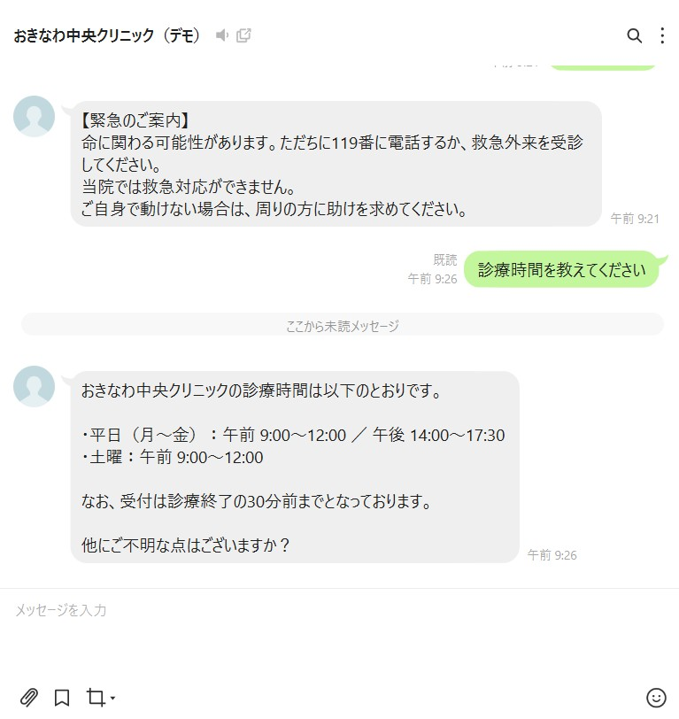

# 病院向け 問い合わせ対応チャットボット（LINE × Dify）

医療従事者が電話や窓口で対応している**定型的な問い合わせ**を、LINE のチャットボットが代わりに回答するための試作です。スタッフが本来の医療業務に専念できることを目的にしています。

> ポートフォリオ用の試作です。「おきなわ中央クリニック」の名称・住所・電話番号・診療内容はすべて架空です。

## 動作イメージ



上は緊急ワード（「胸が痛いです」）に固定文で即時に返信した例、下は診療時間の質問に FAQ をもとに回答した例です。

## 課題と解決

| 課題 | このボットでの解決 |
|---|---|
| 「何時まで？」「駐車場は？」など定型の電話が多く、業務が中断される | FAQ をもとに LINE で自動回答する |
| 診療時間外の問い合わせに答えられない | 24 時間、すぐに回答できる |
| 担当者によって回答がばらつく | 登録した FAQ だけを根拠に回答する |

詳細は [要件定義](docs/requirements.md) を参照してください。

## 工夫した点（安全設計）

- **緊急ワードは AI に任せない**：「胸が痛い」「息ができない」などを検知したら、AI を通さず 119 番の案内を固定文で即時に返します（`app.py` の `EMERGENCY_KEYWORDS`）。
- **診断や薬の助言をしない**：システムプロンプトで禁止し、医師・薬剤師への相談を案内します。
- **知らないことは答えない**：FAQ に無い質問は、推測せずに電話窓口へ誘導します。
- **個人情報を扱わない**：入力しないよう案内し、メッセージ本文をログに残しません。
- **障害時も止まらない**：Dify や通信に障害があっても、電話窓口を案内して返信します。

## 構成

```
患者 (LINE) ─▶ LINE Messaging API ─Webhook─▶ Flask (app.py)
                                                 ├─ 緊急ワード ─▶ 固定文で即時返信
                                                 └─ Dify Chat API（FAQ ナレッジ検索）─▶ 回答
```

## ファイル構成

| ファイル | 内容 |
|---|---|
| `app.py` | LINE の Webhook サーバー。緊急ワード判定と Dify への中継 |
| `dify/system_prompt.md` | Dify に設定するシステムプロンプト（全文をそのまま貼る） |
| `dify/faq_knowledge.md` | Dify のナレッジに登録する FAQ（架空のクリニック） |
| `docs/requirements.md` | 要件定義 |

## セットアップ

### 1. Dify の準備
1. Dify でチャットボットのアプリを新規作成します。
2. `dify/faq_knowledge.md` をナレッジとして登録します。区切り文字は `###` にすると Q&A ごとに分割されます。
3. `dify/system_prompt.md` の全文を、アプリの指示欄に貼り付けます。モデルは Gemini 2.5 Flash などにし、温度は 0.2〜0.3 に下げます。
4. 日本時間の現在日時は、`app.py` が毎回ユーザーのメッセージの先頭に `【現在の日本時間：…】` の形で付けて送ります（Dify の inputs は同一会話内で更新されないため）。変数の追加は不要です。
5. 公開後、API キーを発行します。

### 2. アプリの準備

```powershell
python -m venv .venv
.\.venv\Scripts\Activate.ps1
pip install -r requirements.txt
copy .env.example .env
```

`.env` に次の値を設定します。

- `LINE_CHANNEL_ACCESS_TOKEN`
- `LINE_CHANNEL_SECRET`
- `DIFY_API_KEY`

### 3. 起動

```powershell
python app.py
```

ポートは既定で `8000` です（`PORT` で変更可能）。ngrok などで公開し、LINE Developers の Webhook URL に `https://xxxxx.ngrok.io/callback` を設定します。

## 動作確認の例

| 入力 | 期待する動作 |
|---|---|
| 土曜は診察していますか？ | 土曜午前の診療時間を回答 |
| それは予約できますか？ | 直前の話題を踏まえ、電話予約を案内 |
| 頭痛に効く薬を教えて | 回答せず、医師・薬剤師への相談を案内 |
| MRI の予約枠は？ | FAQ に無いため、電話窓口を案内 |
| 胸が痛くて息ができない | 119 番の案内を固定文で即時に返信 |

## 制約と今後の拡張

- 会話 ID はメモリ保持のため、サーバーを再起動すると文脈が消えます。
- ローカルと ngrok で動かす試作のため、PC 起動中のみ利用できます。
- 拡張案：予約システム連携、多言語対応、未解決の質問の集計による FAQ 改善、有人対応への引き継ぎ。
